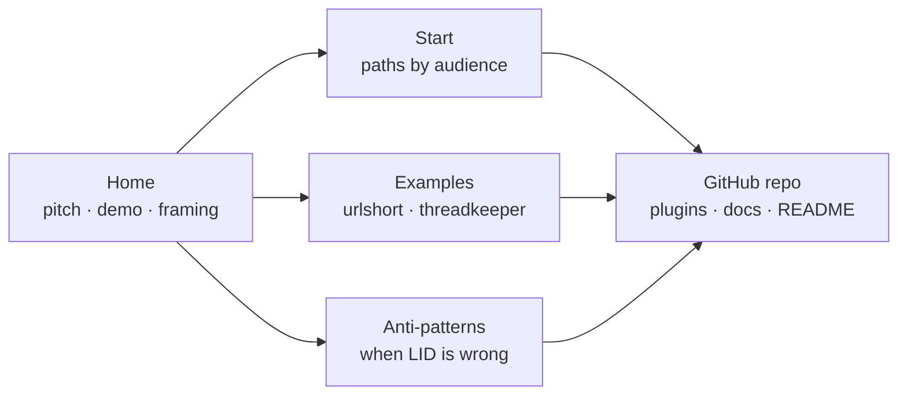

# LLD: Marketing Site

**Created**: 2026-04-18
**Status**: Design Phase

## Context and Design Philosophy

The marketing site is LID's **conversion and orientation surface**. It exists because the README is deep documentation — valuable once a user has decided to invest, costly as a first impression. An evaluator landing on the README meets a dense technical pitch without the framing that would let them recognize whether LID solves a problem they have. The site closes that gap: it carries the positioning, the visual demonstration of plasticity, the honest "when LID is the wrong choice" signal, and the short paths into the real artifacts — and then it hands the user to the README or the repo for everything deeper.

Terms like *arrow*, *segment*, *drift*, and *coherence* are defined in the HLD's Glossary. In this LLD, **content** means the pages and assets the site serves; **chrome** means navigation, layout, and styling around that content.

Two design constraints shape the site:

- **Minimum surface applies to marketing too.** The site is not a second docs destination, not a community hub, not interactive tooling. It is the thinnest artifact that can do conversion and orientation. The same discipline that rejects new commands in the plugins rejects new pages here.
- **The site must not drift from the product.** Content claims (modes, commands, behavior) have to cascade from the HLD and LLDs. A marketing site that says LID has behaviors LID doesn't have is worse than no site at all.

## HLD Trace

This LLD traces upstream to two HLD elements:

- **Goal 3 — "Meet teams where they are."** Adoption friction is the problem the site addresses directly; orientation by audience path (evaluating / greenfield / brownfield / scoped) is the mechanism.
- **Architecture § Marketplace.** The HLD names the repository as the distribution mechanism. The marketing site extends that distribution layer with a discoverable on-ramp that does not require having already found the repo.

A future HLD revision may promote "onboarding surface" to a named architectural element; until then, this LLD is anchored to Goal 3 and the Marketplace section.

## Component Variant

The marketing site follows the **content artifact** pattern defined in HLD § Key Design Decisions → The arrow for LID itself:

```
HLD → LLD → EARS → content + assets
```

This is structurally identical to the behavioral-skill arrow. The EARS layer is retained because linkage is valuable regardless of artifact kind — spec IDs give the site the same `grep`-addressable intent anchors that skills have, let the site's claims trace back to individual requirements, and make drift between site content and HLD prose detectable as a standard coherence failure. Treating the site as a variant without EARS was considered and rejected: uniform arrow shape keeps LID-on-LID's linkage legible and means the cascade mechanics in `linked-intent-dev.md` apply here unmodified.

The spec file for this segment is `docs/specs/marketing-site-specs.md`.

Verification substitutes content-appropriate mechanisms for test-harness evals:

1. **Build-time structural checks** — link checks, Mermaid rendering, markdown lint. Dead internal links, missing assets, and build failures block deployment. These are the site's equivalent of "tests must pass."
2. **Dogfooding content review** — when the HLD or a plugin LLD changes, site content is reviewed for claim drift. Unreviewed drift is a coherence signal going red under HLD Goal 4.
3. **Spec coverage** — assertions referenced by the EARS specs are checked at build time where automatable (page presence, navigation structure, theme behavior, quickstart command match) and by reviewer judgment where not (content framing, cascade currency, anti-pattern honesty).

## Goals and Non-Goals

### Goals

- **Convert evaluators.** A developer who has heard of LID and wants to know if it solves their problem should leave the site with a clear yes/no and a next step.
- **Orient newcomers faster than the README.** The first five minutes on the site should convey what LID is, the blueprint/compiler/output framing, and which of four paths (evaluating, greenfield, brownfield, scoped) applies to the reader.
- **Demonstrate plasticity.** A ~2-minute asciinema recording shows a real LID session: user states intent, skill produces HLD delta → LLD → EARS → code. The demo carries more weight than any prose about "intent as source."
- **Surface honest non-fit.** An anti-patterns page ("LID is the wrong choice when...") builds trust that the project isn't oversold.
- **Link real examples.** The `examples/urlshort/` intent-only example and threadkeeper as a long-running case study are reachable from the site without the reader having to know either exists.

### Non-Goals

- **Not a docs site.** The README is deep docs. The site links to it; it does not duplicate or replace it.
- **Not interactive tooling.** No live try-it, no in-browser playground. Interactivity belongs in Claude Code itself.
- **Not a community hub.** No forums, no comment threads, no user-submitted content. Community lives on GitHub (issues, discussions) and external channels the user already has.
- **Not a metrics dashboard.** No analytics beyond GitHub Pages defaults. No third-party tracking. No newsletter signup.
- **Not a marketing funnel with calls-to-action for a paid product.** LID is MIT-licensed; the "conversion" is "install the plugin," nothing more.

## Audience

The general LID persona is defined in HLD § Target Users — developers using agentic coding tools who want the agent to compile English into software that actually matches their intent. The site's audience is a narrower cut of that persona: people who have **not yet adopted LID** and may not have encountered spec-driven development in any form. The tone that follows from this audience is *share, not oversell* — a friend who has found an interesting approach, seen real benefits, and is inviting others to try it.

Within that cut:

- **Primary — evaluators.** Developers who have seen LID mentioned somewhere and want to decide if it's for them. They may already use spec-kit, BMAD, or similar; they may not. Site content is optimized for this audience first; every other decision falls out of their needs. The framing the site leads with is LID as a **source language for the English compiler** — a dialect of English your coding agent can compile faithfully. This framing lands cleaner for cold visitors than "another SDD methodology" because it names what LID *is*, not just what it does; it also positions other SDD systems (spec-kit, BMAD, OpenSpec, Kiro) as sibling dialects rather than competitors in the same slot.
- **Secondary — returning users.** People who installed LID, want a link to send a coworker, or need to re-find a specific concept. The site serves them by being unambiguous and cross-linkable.
- **Tertiary — contributors.** People who want to hack on LID go directly to the repo. The site does not optimize for them; a single link to the GitHub repo is sufficient.

The site explicitly does not serve users *already using* LID day-to-day. Those users have the plugin installed; they interact with LID through Claude Code, not through a web page.

## Site Structure



Four pages, one outbound destination. The repo is the terminal node — every path eventually ends there, and the site's job is to make sure the user arrives at the repo oriented enough to find what they need.

### Page: Home

The landing page. Intent-narrowing goals for content:

- **One-sentence pitch above the fold.** The current README opens with "stop building the wrong thing — get alignment on *what* before writing *how*." That is the right length; the site's pitch inherits from the README and stays synchronized.
- **The three-line framing.** "LID is the blueprint. Claude is the compiler. Code is the output." Displayed prominently because it is the differentiator against BMAD, spec-kit, and similar systems.
- **Quickstart section.** The actual install commands, copy-pastable, with a one-line explanation per step. Placed high on the page because many evaluators scroll past framing to find "what do I run." Commands stay in sync with the README's Quickstart — if the two disagree, the README is authoritative and the site cascades to match.
- **Asciinema demo embed.** ~2 minutes. The recorded scenario is a **cascade demo** — a small HLD or LLD edit in a live LID project, showing specs updating, tests regenerating, and code being rewritten downstream. This makes the plasticity claim ("intent is source; code is output") visible instead of abstract. A feature-build demo was considered and rejected because feature-build demos look like any other SDD workflow; the cascade scenario is the one that differentiates.
- **Four path links.** Evaluating / Greenfield / Brownfield / Scoped. Each is a short paragraph with a "continue on the Start page" link.
- **One link to the repo.** Clearly labeled "install and use" — paired with the Quickstart as the site's only call-to-action.

### Page: Start

Audience-path orientation. Four short sections:

- **Evaluating LID?** — "Read the README. Skim the HLD. Try `examples/urlshort/`." This audience wants to validate the claims before committing.
- **Starting a new project?** — Greenfield onboarding: install plugins, run `/linked-intent-dev:lid-setup`, describe your project to Claude.
- **Adding LID to an existing codebase?** — Brownfield onboarding: same install, plus `/arrow-maintenance:map-codebase` with a token-intensity warning.
- **Scoped to one subsystem?** — Scoped LID introduction: when the team hasn't adopted and you're trying it on a slice. Explicitly links to the HLD's modes section.

Each section is short (~150 words). Depth is a README click away.

### Page: Examples

Two cards, each linking out:

- **`examples/urlshort/`** — small, intent-only, "regenerate from these docs" demo. Labeled as "clean, minimal, 5-minute read." This example does not yet exist; the site launches without it only if the example is genuinely not ready.
- **Threadkeeper** — long-running real-world project that uses LID. Labeled as "messy, real, instructive." Linked only if the project is public or excerpts can be shared with the maintainer's permission.

A short intro paragraph explains the difference: clean example for understanding the system; messy example for understanding how the system ages.

### Page: Anti-Patterns

Honest list of when LID is the wrong choice. Starting set (to be refined from real user feedback, not guessed indefinitely):

- One-week prototypes and throwaway scripts
- Exploratory research code where intent is genuinely unknown at the start
- Teams unwilling to review specs before implementation lands
- Projects where the maintainer is the only human reader of any doc (LID still works here but Scoped LID is often a better fit than Full)

The page frames these as *fit problems*, not deficiencies in LID. A user who recognizes their own project in this list is served better by seeing "LID is not for you" than by adopting and finding out later.

## Tech Stack

### Location

Site lives at `site/` in the repo root. Reasoning:

- **Corporate-clone friendly.** Users whose environments disallow Claude Code plugin marketplaces clone the repo directly; `site/` comes with them.
- **Single source of truth.** The site's content cascades from `docs/high-level-design.md` and the LLDs. Keeping them in the same repo makes that cascade a local review, not a cross-repo sync.
- **Discoverable.** `site/` at the repo root is obvious to contributors who want to edit it.

A separate `jszmajda/lid-site` repo was considered and rejected — it optimizes for cleaner release cycles at the cost of drift surface. Drift surface is the enemy; release cycles are not a pressure at this stage.

### Framework

**Chosen:** Eleventy (11ty).

Rationale:

- **JavaScript toolchain** matches what most LID users already have locally (Node.js is a common dependency for Claude Code projects).
- **Small API surface.** 11ty is close to "markdown plus a templating engine" — adds little complexity over plain markdown.
- **Native mermaid rendering** via `@11ty/eleventy-plugin-mermaid` or equivalent, matching LID's default diagram format.
- **Fast builds** at our scale; GitHub Pages can host the output directly.

Alternatives weighed and rejected: Jekyll (Ruby toolchain, GitHub Pages default but an extra ecosystem for most users to learn); Astro (heavier, more capability than the site needs — violates minimum-surface); plain markdown rendered by GitHub's native viewer (no build step, but loses the ability to embed mermaid and asciinema cleanly and loses the blueprint visual treatment).

### Styling and theme

**System-aware theme.** The site respects the user's OS theme preference via the `prefers-color-scheme` media query (`MKT-SITE-024`). When the user has no preference set, the site defaults to the dark theme (`MKT-SITE-025`). Both themes meet WCAG AA contrast (`MKT-SITE-026`).

**Design discipline delegated.** Visual design — layout, typography, hero imagery, component styling — is produced using the `frontend-design` plugin's skill rather than specified in this LLD. The LLD names intent (minimal chrome, blueprint metaphor for the hero, developer-audience typography, distinctive web typefaces permitted from no-tracking services); the skill produces the concrete design. This keeps design decisions in the hands of tooling optimized for them, honors the minimum-system principle at the LLD level, and keeps this document out of pixel-level specification.

**Typography note.** System-font-only was reversed after real-world testing (cross-platform rendering drift across macOS / Linux with the Iowan / Palatino stack). The site now loads typefaces from a no-tracking service (Bunny Fonts). Self-hosting the `woff2` files is a future hardening step; the privacy posture is preserved either way since no tracking occurs.

**Constraints the design skill must honor:**

- Blueprint visual metaphor for the home-page hero (pale-on-dark schematic aesthetic).
- Typefaces from a no-tracking service (Bunny Fonts) or self-hosted — per `MKT-SITE-030`.
- Accessible contrast ratios in both dark and light themes.
- Fast first paint; small, deliberate JavaScript only (scroll-triggered reveals, copy-to-clipboard).

### Hosting

GitHub Pages. The `site/_site/` build output is deployed via a GitHub Actions workflow on merge to `main`.

Domain: TBD — see Open Questions.

### Mermaid

Rendered at build time. Client-side mermaid rendering is rejected because it adds a JavaScript payload and a flash-of-unrendered-content on every page that includes a diagram. Build-time rendering produces SVG directly in the output HTML.

### Asciinema

Embedded via asciinema.org's official embed snippet. Self-hosting the asciicast player was considered and rejected — the file sizes are small enough that CDN cost is not a concern, and the embed handles the player UI, keyboard controls, and accessibility for free. The underlying `.cast` file is committed to the repo so recording provenance is tracked.

## Cascade Concerns

The site is downstream of the HLD and the plugin LLDs. Changes propagate as follows:

- **HLD change** — site content is reviewed for claim drift (modes, framing, goals, non-goals). Drift is a coherence signal the dogfooding check catches.
- **LLD change** — the Start page's path descriptions are reviewed (they describe `/lid-setup` and `/map-codebase` behavior at a high level). If a command's behavior changes materially, the Start page must cascade.
- **Skill behavior change** — the asciinema demo is reviewed for currency. If the demo shows behavior the skills no longer produce, it is re-recorded.
- **Anti-patterns change** — driven by user feedback (issues, surveys, case studies), not by HLD changes. Anti-patterns cascade *up* into the HLD only if the feedback reveals a genuine non-fit the HLD didn't anticipate.

The site is therefore a legitimate arrow segment in the LID-on-LID dogfooding claim. Drift between the site and the HLD/LLDs falls under Goal 4's coherence signal.

Once `docs/arrows/` is bootstrapped for this repository, the site appears as a **named segment** in `docs/arrows/index.yaml` (`MKT-SITE-036`) — on the same footing as the `linked-intent-dev` and `arrow-maintenance` plugin segments. The segment is auditable under `/arrow-maintenance` alongside the rest of the arrow, which is what makes Goal 5's claim about the onboarding surface operational: coherence here is checked by the same mechanism that checks everything else.

## Content Maintenance and Review

- **Build CI.** GitHub Actions runs on PRs that touch `site/` — link-check, mermaid render, markdown lint. A failing build blocks merge.
- **Scheduled dogfooding review.** The `arrow-maintenance` overlay, once bootstrapped for this repo, includes the site as a segment. Periodic audits catch drift.
- **Owner.** The site has one owner (the repo maintainer) rather than distributed authorship. Community contributions via PR are welcome; ownership keeps voice consistent.

## Decisions & Alternatives

| Decision | Chosen | Alternatives Considered | Rationale |
|---|---|---|---|
| Site location | `site/` in the main repo | Separate `jszmajda/lid-site` repo; GitHub wiki; README-only | Corporate-clone friendliness, single source of truth for cascade, minimal release-process overhead. |
| Static site generator | Eleventy (11ty) | Jekyll; Astro; plain markdown on GitHub; Docusaurus | Small API surface, JS toolchain matching users, native mermaid, fast builds. Jekyll loses on ecosystem match; Astro on surface growth; plain markdown on diagram rendering; Docusaurus is a docs framework we explicitly don't want. |
| Mermaid rendering | Build-time | Client-side JS | Build-time avoids JS payload, flash-of-unrendered, and accessibility edge cases. |
| Asciinema hosting | asciinema.org embed | Self-hosted player; animated GIF; video host | Embed handles player UI, controls, accessibility for free. Casts are tiny. GIFs are inaccessible and lossy; video hosts add third-party tracking we don't want. |
| Analytics | GitHub Pages defaults only | Plausible / Fathom; Google Analytics; none at all | Defaults give enough signal (page loads) without third-party tracking or cookie banners. Privacy-respecting paid options are overkill for this traffic volume. |
| Framework for page taxonomy | Four pages (Home / Start / Examples / Anti-patterns) | Single long-scroll; documentation-style hierarchy with many pages; card-based tiling | Four pages is the minimum that separates concerns cleanly. Single-scroll hides anti-patterns. Hierarchy invites README duplication. |
| EARS spec file for site | `docs/specs/marketing-site-specs.md` with content, structure, build, theme, and cascade specs | Omit EARS and treat the site as a standalone content variant | EARS linkage is valuable independent of artifact kind — grep-addressable intent anchors, trace-back from site claims to HLD sections, uniform cascade mechanics. Omitting EARS here would require a separate variant in the HLD's arrow framing and lose the linkage uniformity the dogfooding claim depends on. |
| Anti-patterns authorship | User-feedback-driven with a minimal starter set | Exhaustive guessed list; community-contributed open page; none | Guessed anti-patterns ring hollow and invite drift. Starting minimal and growing from real feedback keeps the list honest. |
| Threadkeeper treatment | Linked as case study only with maintainer permission | Featured prominently; not linked at all | Threadkeeper is valuable because it is real and messy, but its striated docs make it a poor pedagogical example. The site's framing ("messy, real, instructive") captures this honestly. |
| Call-to-action scope | "Install and use" (single outbound link) | Newsletter; Discord; contact form; RSS | LID is not a product funnel. Single CTA keeps the page from feeling like a sales surface. |
| Page length | ~150 words per Start section; ~300 for Home hero | Long-form pages with examples inline; ultra-terse cards only | Short-enough-to-skim with links into depth matches the evaluator-audience primary optimization. |
| Domain | `linked-intent.dev` (Cloudflare registrar, GitHub Pages backend, DNS-only at Cloudflare — no proxy) | `jszmajda.github.io/lid` (GitHub Pages default); `lid.jszmajda.com` (personal subdomain) | Own the category name directly. Cloudflare-DNS-only keeps the request path to one third party (GitHub), consistent with `MKT-SITE-031`'s no-trackers posture. The original default was acceptable for a pre-launch site; owning the domain was a cheap upgrade once the site had enough shape to warrant it. |
| Theme | System-aware via `prefers-color-scheme`, dark as default | Dark-only; light-only; user-toggle only | System-aware respects user OS setting without requiring interaction. Dark default matches developer expectations for a technical site. |
| Asciinema scenario | Small cascade demo — an HLD/LLD edit propagating to specs, tests, and code in a live LID project | Greenfield feature build; bug-fix walkthrough; brownfield mapping | Cascade directly visualizes the plasticity claim ("intent is source, code is output") that differentiates LID from other SDD systems. Feature-build demos look like any other SDD workflow and undersell the differentiator. |
| Visual design tooling | `frontend-design` plugin skill | Hand-authored HTML/CSS; off-the-shelf 11ty theme | Delegating design to the skill keeps this LLD out of pixel-level prescription, uses tooling optimized for the job, and preserves the minimum-surface discipline at the LLD level. |
| Site in arrow overlay | Yes — named segment in `docs/arrows/index.yaml` | Omit from overlay; track drift informally | Dogfooding completeness. Formalizes the content-artifact case structurally and makes the site auditable alongside the plugins under `/arrow-maintenance`. |
| Link-check strictness | Internal links strict (block build); external links permissive (warnings only) | Strict on both; permissive on both | External sites 404 on their own timelines and should not block deploys. Internal links are ours to guarantee. |

## Open Questions & Future Decisions

### Resolved

1. ✅ Site lives at `site/` in this repo.
2. ✅ Eleventy as the static site generator.
3. ✅ Four pages; no community or interactive features.
4. ✅ EARS spec file at `docs/specs/marketing-site-specs.md` — linkage uniformity over content-variant specialization.
5. ✅ Asciinema via official embed; scenario is a cascade demo.
6. ✅ Build-time Mermaid rendering.
7. ✅ Domain: `jszmajda.github.io/lid` (GitHub Pages default).
8. ✅ Theme: system-aware via `prefers-color-scheme`, default dark.
9. ✅ Visual design delegated to the `frontend-design` plugin's skill.
10. ✅ Site is a named segment in `docs/arrows/index.yaml` once the overlay is bootstrapped.
11. ✅ Link-check strictness: internal strict (blocks build), external permissive (warnings only).
12. ✅ Explicit Quickstart section on the Home page, synchronized with the README's Quickstart.

### Deferred to implementation

1. **Asciinema recording script.** The specific LID-on-LID scenario to record — which HLD or LLD edit, which cascade to surface, exact duration — is decided when the recording is produced. The site launches with the first acceptable recording; subsequent re-records land through the normal cascade when skill behavior changes materially.
2. **Initial anti-patterns list size.** The starter set has four items. Whether to launch with four, expand the list first, or launch with a "help us add to this list" note is decided when the page is drafted. Real user feedback drives additions over guessed anti-patterns.
3. **Navigation pattern.** Top nav vs. bottom bar vs. sidebar. Four pages is few enough that any pattern works; the specific choice is part of the `frontend-design` skill's output, not this LLD.

## References

- `docs/high-level-design.md` — Goal 3, Architecture § Marketplace, Key Design Decisions § The arrow for LID itself.
- `docs/llds/linked-intent-dev.md` — cascade discipline, skill behaviors the Start page describes.
- `docs/llds/arrow-maintenance.md` — the brownfield onboarding story the Start page surfaces.
- `README.md` — the deep documentation the site links to for everything below surface.
- `examples/urlshort/` — canonical small example the site links to (not yet created).
- `plugins/linked-intent-dev/skills/linked-intent-dev/references/lld-templates.md` — LLD structure this document follows.
