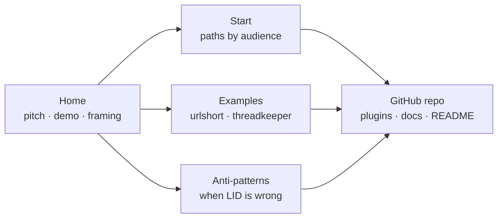

# LLD: Marketing Site

**Created**: 2026-04-18
**Status**: Design Phase

## Context and Design Philosophy

The marketing site is LID's **conversion and orientation surface**. It exists because the README is deep documentation — valuable once a user has decided to invest, costly as a first impression. An evaluator landing on the README meets a dense technical pitch without the framing that would let them recognize whether LID solves a problem they have. The site closes that gap: it carries the positioning, the visual demonstration of plasticity, the honest "when LID is the wrong choice" signal, and the short paths into the real artifacts — and then it hands the user to the README or the repo for everything deeper.

Terms like *arrow*, *segment*, *drift*, and *coherence* are defined in the HLD's Glossary. In this LLD, **content** means the pages and assets the site serves; **chrome** means navigation, layout, and styling around that content.

Two design constraints shape the site:

- **Minimum surface applies to marketing too.** The site is not a second docs destination, not a community hub, not interactive tooling. It is the thinnest artifact that can do conversion and orientation. The same discipline that rejects new commands in the plugins rejects new pages here.
- **The site must not drift from the product.** Content claims (modes, commands, behavior) have to cascade from the HLD and LLDs. A marketing site that says LID has behaviors LID doesn't have is worse than no site at all.

## HLD Trace

This LLD traces upstream to three HLD elements:

- **Goal 5 — "Make LID's value legible to those not yet using it."** This is the direct mandate for the onboarding surface (README, marketing site, examples). The HLD names the gap between "heard of LID" and "running LID" as an intent gap at project scale, and designates the marketing site as load-bearing intent that must cascade from the HLD like any other segment. This LLD is the site's realization of that goal.
- **Goal 3 — "Meet teams where they are."** Adoption friction is the broader problem the site addresses; orientation by audience path (evaluating / greenfield / brownfield / scoped) is the mechanism.
- **Architecture § Distribution.** The HLD names the repository as the distribution mechanism. The marketing site extends that distribution layer with a discoverable on-ramp that does not require having already found the repo.

Goal 5 is the anchor that most directly names the site's reason for existing; Goal 3 and Architecture § Distribution are how Goal 5 is served in practice.

## Component Variant

The marketing site follows the **content artifact** pattern defined in HLD § Key Design Decisions → The arrow for LID itself:

```
HLD → LLD → EARS → content + assets
```

This is structurally identical to the behavioral-skill arrow. The EARS layer is retained because linkage is valuable regardless of artifact kind — spec IDs give the site the same `grep`-addressable intent anchors that skills have, let the site's claims trace back to individual requirements, and make drift between site content and HLD prose detectable as a standard coherence failure. Treating the site as a variant without EARS was considered and rejected: uniform arrow shape keeps LID-on-LID's linkage legible and means the cascade mechanics in `linked-intent-dev.md` apply here unmodified.

The spec file for this segment is `docs/specs/marketing-site-specs.md`.

Verification substitutes content-appropriate mechanisms for test-harness evals:

1. **Build-time structural checks** — link checks, Mermaid rendering, markdown lint. Dead internal links, missing assets, and build failures block deployment. These are the site's equivalent of "tests must pass."
2. **Dogfooding content review** — when the HLD or a plugin LLD changes, site content is reviewed for claim drift. Unreviewed drift is a coherence signal going red under HLD Goal 4.
3. **Spec coverage** — assertions referenced by the EARS specs are checked at build time where automatable (page presence, navigation structure, theme behavior, quickstart command match) and by reviewer judgment where not (content framing, cascade currency, anti-pattern honesty).

## Goals and Non-Goals

### Goals

- **Convert evaluators.** A developer who has heard of LID and wants to know if it solves their problem should leave the site with a clear yes/no and a next step.
- **Orient newcomers faster than the README.** The first five minutes on the site should convey what LID is, the blueprint/compiler/output framing, and which of four paths (evaluating, greenfield, brownfield, scoped) applies to the reader.
- **Demonstrate plasticity.** A ~2-minute asciinema recording shows a real LID session: user states intent, skill produces HLD delta → LLD → EARS → code. The demo carries more weight than any prose about "intent as source."
- **Surface honest non-fit.** An anti-patterns page ("LID is the wrong choice when...") builds trust that the project isn't oversold.
- **Link real examples.** The `examples/urlshort/` intent-only example and threadkeeper as a long-running case study are reachable from the site without the reader having to know either exists.

### Non-Goals

- **Not a docs site.** The README is deep docs. The site links to it; it does not duplicate or replace it.
- **Not interactive tooling.** No live try-it, no in-browser playground. Interactivity belongs in the user's coding agent itself.
- **Not a community hub.** No forums, no comment threads, no user-submitted content. Community lives on GitHub (issues, discussions) and external channels the user already has.
- **Not a metrics dashboard.** No analytics beyond GitHub Pages defaults. No third-party tracking. No newsletter signup.
- **Not a marketing funnel with calls-to-action for a paid product.** LID is MIT-licensed; the "conversion" is "install the plugin," nothing more.

## Audience

The general LID persona is defined in HLD § Target Users — developers using agentic coding tools who want the agent to compile English into software that actually matches their intent. The site's audience is a narrower cut of that persona: people who have **not yet adopted LID** and may not have encountered spec-driven development in any form. The tone that follows from this audience is *share, not oversell* — a friend who has found an interesting approach, seen real benefits, and is inviting others to try it.

Within that cut:

- **Primary — evaluators.** Developers who have seen LID mentioned somewhere and want to decide if it's for them. They may already use another spec-driven system; they may not. Site content is optimized for this audience first; every other decision falls out of their needs. The framing the site leads with is LID as **a structured way to write intent for your coding agent** — a layered organization of what you say at different levels of detail, from broad direction down to the granular claims that tests can verify. This framing lands cleaner for cold visitors than "another SDD methodology" because it names what LID *is*, not just what it does. The site never names specific competing systems. Two reasons: the set of comparable tools churns quickly and any named comparison dates fast, and publicly listing competitors is a follower's move that reads as one — a category definer simply describes what it is.
- **Secondary — returning users.** People who installed LID, want a link to send a coworker, or need to re-find a specific concept. The site serves them by being unambiguous and cross-linkable.
- **Tertiary — contributors.** People who want to hack on LID go directly to the repo. The site does not optimize for them; a single link to the GitHub repo is sufficient.

The site explicitly does not serve users *already using* LID day-to-day. Those users have their adapter or plugin installed; they interact with LID through their coding agent, not through a web page.

## Site Structure



Four pages, one outbound destination. The repo is the terminal node — every path eventually ends there, and the site's job is to make sure the user arrives at the repo oriented enough to find what they need.

### Page: Home

The landing page. Section ordering is deliberate: the page walks a cold evaluator from *what is this* through *how does it work* and *what does it look like in motion* before asking them to install anything. Top-to-bottom:

1. **Hero — pitch, framing, schematic.**
   - One-sentence pitch above the fold, inherited from the README's opening.
   - Three-line framing: "LID is the language. Claude is the compiler. Code is the output." Displayed prominently because the compiler metaphor names what LID *is* rather than what it does — a structured source you write (at different levels of detail) versus a methodology you adopt. "Language" here is used metaphorically; LID is a structure for the compiler's input, not a formal grammar or a dialect. No specific peer systems are named.
   - Arrow-of-intent schematic (the hero SVG) reinforces the blueprint metaphor visually.

2. **How it works.** A structural explanation of LID as a shape, not as prose. The narrative order is: section header and lede → a **five-panel trace** carrying one concrete example end-to-end (HLD sentence → LLD paragraph → EARS claim → failing-first test → `@spec`-annotated code), with the compact one-arrow schematic repurposed as a legend/key and a short grep-addressability note paired alongside → a bridge paragraph → the full **DAG** showing every arrow across the whole repository → an outro paragraph on what an upstream edit feels like. The trace's five panels always stack vertically so the cascade reads downward (matching both the methodology and the DAG below) and so the shared EARS ID propagates *down* the column from EARS to Tests to Code. At narrow breakpoints the whole trace block flows as a single column — legend, then strip, then grep-note. At ≥960px the trace block splits into a two-column pair: the legend schematic and the grep-note occupy the left column as "how to read the trace", and the vertical strip of five panels fills the right column as "the trace itself". The DAG+outro pair block below remains a two-column breakout at ≥1100px.

   The lede opens with LID's own claim — "LID treats your whole repository as a graph rooted in intent" — and is followed immediately by the memorable framing that checking whether code still matches design is "just a walk through the graph." No competitor systems are named; an earlier draft listed several by name to sharpen the differentiator, but the set of comparable systems shifts quickly and listing peers publicly reads as a follower rather than a category definer. An earlier version of the punchline used the phrase "a coherence audit" but that term has no referent for most readers; rewriting it in plain English ("checking that the code still matches the design") keeps the mic-drop cadence while staying legible to the target audience. The concrete chain in the lede ("every code file reachable from a test; every test from a spec; every spec from a design; every design from the HLD") carries the differentiator on its own by describing something no purely-comparative framing would establish.

   **The trace (legend + five panels).** The earlier version of this section paired the inset schematic on the left with an `@spec`-annotated code snippet on the right. That arrangement named the five rungs abstractly (via the schematic's labels) but only showed the terminus concretely (the snippet), leaving the reader to *infer* that the same intent really did thread from HLD down through to code. The replacement makes the linkage visible. One worked example — account-scoped authentication — is shown at each of the five levels of resolution in its own compact "plate" panel:

   - **HLD panel** — one sentence of intent (the *why*). Example: *"The app is account-scoped — only the account owner can see or change their data."*
   - **LLD panel** — one paragraph of design (the *how*). Example: a short description of the auth flow from login form through the auth service, naming the return contract (session on valid credentials, `AuthError` on invalid).
   - **EARS panel** — one atomic claim in structured-English form, annotated with its grep-addressable ID (`AUTH-UI-001`).
   - **Tests panel** — two failing-first test names, each tagged with the EARS ID it asserts.
   - **Code panel** — the same `@spec`-annotated file-header-and-signature snippet the earlier design used as a standalone element, now landing as the trace's terminus and carrying `AUTH-UI-001` and `AUTH-UI-002` in its annotation comment.

   The example is **authored backward** from the existing code anchor: the code snippet came first (the site's original grep-addressability demonstration), and the upstream rungs are what that snippet's `@spec` annotation *would have required* if one had genuinely walked the arrow down from HLD to code. This direction of authorship matters pedagogically — it matches how an evaluator reads the page (code is visible in their editor; the question the trace answers is "what intent does this annotation trace back to?"). It also means the existing snippet and the existing schematic are preserved as design primitives rather than replaced.

   The shared EARS ID (`AUTH-UI-001`) is the visible through-line. It first appears on the EARS panel where the claim is born, and persists visibly on the Tests panel (as the assertion's anchor) and on the Code panel (in the `@spec` comment). HLD and LLD panels do not carry the ID, because the ID doesn't yet exist at those rungs — that asymmetry is intentional and teaches that EARS is where grep-addressability begins.

   **Legend.** The compact five-node arrow schematic (`HLD → LLD → EARS → Tests → CODE`) is repurposed as a legend, serving as the key that labels the rungs the reader is about to see instantiated. At narrow widths the legend sits above the trace strip; at ≥960px it sits in the left column of the two-up pair, alongside the grep-addressability note, with the vertical five-panel strip filling the right column. The legend schematic remains horizontally oriented at all widths — its native 540×140 aspect scales cleanly into either placement.

   The DAG's edges carry arrowheads to make directionality unambiguous — cascade flows strictly downward. Two edges between the Tests tier and the Code tier are drawn in the accent color to highlight the DAG-not-tree property: one test can cover more than one code file, and one code file can be covered by more than one test.

   **Locus-of-work framing.** The outro paragraph names explicitly where the user actually spends time in LID: in the HLD and (most often) the LLDs. The specs, tests, and code are agent-generated artifacts that the user reviews and accepts rather than writes. Application changes and bug fixes both route back to an LLD edit — the LLD is the practical entry point for almost every adjustment. This framing is load-bearing because "where will I be working?" is one of the first questions an evaluator silently asks, and the site's answer should be concrete, not mystical. The home page's own maintenance loop is a small existence proof: the site evolves by iterating on the LLD and letting the downstream artifacts cascade.

   **Layout.** The trace's five panels always stack vertically. At narrow widths the whole block flows as a single column (legend → strip → grep-note). At ≥960px the block splits into a two-column pair: the legend schematic and the grep-note stack in the left column; the vertical five-panel strip fills the right column and spans both rows of the left side. Header, lede, and bridge paragraph remain full-width at all widths. The DAG+outro pair below the bridge stays as a two-column breakout at ≥1100px (DAG right, outro left). Having the trace as one pair-block and the DAG+outro as a second, differently-shaped pair block (the trace's right column is a vertical list of panels; the DAG+outro pair is one large figure alongside prose) keeps the two from reading as one repeated layout.

   **Why vertical and not horizontal.** An earlier iteration tried a five-panel horizontal strip at wide widths, with the legend above and the grep-note below. It was rejected after real-world testing: (1) the cascade metaphor is a *downward* flow, but left-to-right reading order meant the ID-through-line (`AUTH-UI-001` on EARS, Tests, Code) propagated *rightward* instead, which fought the methodology's own framing; (2) dividing a 1200-px viewport into five columns left each panel with ~200px of content width — enough for a sentence but cramped for a code snippet, forcing aggressive content shortening that thinned out the example; (3) the shape didn't match the DAG below (which cascades downward), so the two visuals on the same page taught different directions. Switching to always-vertical made the ID-through-line cascade down the right column, the panels breathe at full column width, and the trace and DAG share a visual direction.

3. **Cascade demo (asciinema embed).** ~2 minutes. The recorded scenario is a small HLD or LLD edit in a live LID project, showing specs updating, tests regenerating, and code being rewritten downstream. Placed immediately after How it works so the evaluator who has just seen the structural explanation watches it animate. A feature-build demo was considered and rejected because feature-build demos look like any other SDD workflow; the cascade scenario is the one that differentiates.

4. **Quickstart.** The actual install commands, copy-pastable, with a one-line explanation per step. Placed after How it works and the demo — a reversal of the earlier ordering, which put Quickstart directly below the hero. Original rationale was that evaluators scroll past framing to find "what do I run"; in practice the page lost the evaluator who needed a mental model before commands, and the three-line framing alone was not doing that work. Pushing install below How it works and the demo restores that orientation. The hero already exposes an "Install" CTA that anchor-links to the Quickstart, so an evaluator who *has* already decided is one click away from the commands regardless of where the section lives in the flow — the demotion costs the decided reader nothing and pays the still-evaluating reader a mental model. Commands stay in sync with the README's Quickstart — if the two disagree, the README is authoritative and the site cascades to match.

5. **Four path links.** Evaluating / Greenfield / Brownfield / Scoped. Each is a short paragraph with a "continue on the Start page" link.

6. **Repo link.** The hero's CTA row already includes a "Read the source" link to GitHub alongside "Install"; the page has no separate terminal CTA. The single-CTA discipline is preserved — "install and use" remains the only action the site asks for. The secondary label is "Read the source" rather than a generic "On GitHub" because the target audience (developers already using agentic coding tools) trusts "read the source" as an invitation to inspect rather than as a download prompt.

### Page: Start

Audience-path orientation. Four short sections:

- **Evaluating LID?** — "Read the README. Skim the HLD. Try `examples/urlshort/`." This audience wants to validate the claims before committing.
- **Starting a new project?** — Greenfield onboarding: install plugins, run `/linked-intent-dev:lid-setup`, describe your project to Claude.
- **Adding LID to an existing codebase?** — Brownfield onboarding: same install, plus `/arrow-maintenance:map-codebase` with a token-intensity warning.
- **Scoped to one subsystem?** — Scoped LID introduction: when the team hasn't adopted and you're trying it on a slice. Explicitly links to the HLD's modes section.

Each section is short (~150 words). Depth is a README click away.

### Page: Examples

Two cards, each linking out:

- **`examples/urlshort/`** — small, intent-only, "regenerate from these docs" demo. Labeled as "clean, minimal, 5-minute read." This example does not yet exist; the site launches without it only if the example is genuinely not ready.
- **Threadkeeper** — long-running real-world project that uses LID. Labeled as "messy, real, instructive." Linked only if the project is public or excerpts can be shared with the maintainer's permission.

A short intro paragraph explains the difference: clean example for understanding the system; messy example for understanding how the system ages.

### Page: Anti-Patterns

Honest list of when LID is the wrong choice. Starting set (to be refined from real user feedback, not guessed indefinitely):

- One-week prototypes and throwaway scripts
- Exploratory research code where intent is genuinely unknown at the start
- Teams unwilling to review specs before implementation lands
- Projects where the maintainer is the only human reader of any doc (LID still works here but Scoped LID is often a better fit than Full)

The page frames these as *fit problems*, not deficiencies in LID. A user who recognizes their own project in this list is served better by seeing "LID is not for you" than by adopting and finding out later.

## Tech Stack

### Location

Site lives at `site/` in the repo root. Reasoning:

- **Corporate-clone friendly.** Users whose environments disallow third-party plugin sources clone the repo directly; `site/` comes with them.
- **Single source of truth.** The site's content cascades from `docs/high-level-design.md` and the LLDs. Keeping them in the same repo makes that cascade a local review, not a cross-repo sync.
- **Discoverable.** `site/` at the repo root is obvious to contributors who want to edit it.

A separate `jszmajda/lid-site` repo was considered and rejected — it optimizes for cleaner release cycles at the cost of drift surface. Drift surface is the enemy; release cycles are not a pressure at this stage.

### Framework

**Chosen:** Eleventy (11ty).

Rationale:

- **JavaScript toolchain** matches what most LID users already have locally (Node.js is a common dependency for agentic coding projects).
- **Small API surface.** 11ty is close to "markdown plus a templating engine" — adds little complexity over plain markdown.
- **Native mermaid rendering** via `@11ty/eleventy-plugin-mermaid` or equivalent, matching LID's default diagram format.
- **Fast builds** at our scale; GitHub Pages can host the output directly.

Alternatives weighed and rejected: Jekyll (Ruby toolchain, GitHub Pages default but an extra ecosystem for most users to learn); Astro (heavier, more capability than the site needs — violates minimum-surface); plain markdown rendered by GitHub's native viewer (no build step, but loses the ability to embed mermaid and asciinema cleanly and loses the blueprint visual treatment).

### Styling and theme

**System-aware theme.** The site respects the user's OS theme preference via the `prefers-color-scheme` media query (`MKT-SITE-024`). When the user has no preference set, the site defaults to the dark theme (`MKT-SITE-025`). Both themes meet WCAG AA contrast (`MKT-SITE-026`).

**Design discipline delegated.** Visual design — layout, typography, hero imagery, component styling — is produced using the `frontend-design` plugin's skill rather than specified in this LLD. The LLD names intent (minimal chrome, blueprint metaphor for the hero, developer-audience typography, distinctive web typefaces permitted from no-tracking services); the skill produces the concrete design. This keeps design decisions in the hands of tooling optimized for them, honors the minimum-system principle at the LLD level, and keeps this document out of pixel-level specification.

**Typography note.** System-font-only was reversed after real-world testing (cross-platform rendering drift across macOS / Linux with the Iowan / Palatino stack). The site now loads typefaces from a no-tracking service (Bunny Fonts). Self-hosting the `woff2` files is a future hardening step; the privacy posture is preserved either way since no tracking occurs.

**Constraints the design skill must honor:**

- Blueprint visual metaphor for the home-page hero (pale-on-dark schematic aesthetic).
- Typefaces from a no-tracking service (Bunny Fonts) or self-hosted — per `MKT-SITE-030`.
- Accessible contrast ratios in both dark and light themes.
- Fast first paint; small, deliberate JavaScript only (scroll-triggered reveals, copy-to-clipboard).

### Hosting

GitHub Pages. The `site/_site/` build output is deployed via a GitHub Actions workflow on merge to `main`.

Domain: TBD — see Open Questions.

### Mermaid

Rendered at build time. Client-side mermaid rendering is rejected because it adds a JavaScript payload and a flash-of-unrendered-content on every page that includes a diagram. Build-time rendering produces SVG directly in the output HTML.

### Asciinema

Embedded via asciinema.org's official embed snippet. Self-hosting the asciicast player was considered and rejected — the file sizes are small enough that CDN cost is not a concern, and the embed handles the player UI, keyboard controls, and accessibility for free. The underlying `.cast` file is committed to the repo so recording provenance is tracked.

## Cascade Concerns

The site is downstream of the HLD and the plugin LLDs. Changes propagate as follows:

- **HLD change** — site content is reviewed for claim drift (modes, framing, goals, non-goals). Drift is a coherence signal the dogfooding check catches.
- **LLD change** — the Start page's path descriptions are reviewed (they describe `/lid-setup` and `/map-codebase` behavior at a high level). If a command's behavior changes materially, the Start page must cascade.
- **Skill behavior change** — the asciinema demo is reviewed for currency. If the demo shows behavior the skills no longer produce, it is re-recorded.
- **Anti-patterns change** — driven by user feedback (issues, surveys, case studies), not by HLD changes. Anti-patterns cascade *up* into the HLD only if the feedback reveals a genuine non-fit the HLD didn't anticipate.

The site is therefore a legitimate arrow segment in the LID-on-LID dogfooding claim. Drift between the site and the HLD/LLDs falls under Goal 4's coherence signal.

Once `docs/arrows/` is bootstrapped for this repository, the site appears as a **named segment** in `docs/arrows/index.yaml` (`MKT-SITE-036`) — on the same footing as the `linked-intent-dev` and `arrow-maintenance` plugin segments. The segment is auditable under `/arrow-maintenance` alongside the rest of the arrow, which is what makes Goal 5's claim about the onboarding surface operational: coherence here is checked by the same mechanism that checks everything else.

## Content Maintenance and Review

- **Build CI.** GitHub Actions runs on PRs that touch `site/` — link-check, mermaid render, markdown lint. A failing build blocks merge.
- **Scheduled dogfooding review.** The `arrow-maintenance` overlay, once bootstrapped for this repo, includes the site as a segment. Periodic audits catch drift.
- **Owner.** The site has one owner (the repo maintainer) rather than distributed authorship. Community contributions via PR are welcome; ownership keeps voice consistent.

## Decisions & Alternatives

| Decision | Chosen | Alternatives Considered | Rationale |
|---|---|---|---|
| Site location | `site/` in the main repo | Separate `jszmajda/lid-site` repo; GitHub wiki; README-only | Corporate-clone friendliness, single source of truth for cascade, minimal release-process overhead. |
| Static site generator | Eleventy (11ty) | Jekyll; Astro; plain markdown on GitHub; Docusaurus | Small API surface, JS toolchain matching users, native mermaid, fast builds. Jekyll loses on ecosystem match; Astro on surface growth; plain markdown on diagram rendering; Docusaurus is a docs framework we explicitly don't want. |
| Mermaid rendering | Build-time | Client-side JS | Build-time avoids JS payload, flash-of-unrendered, and accessibility edge cases. |
| Asciinema hosting | asciinema.org embed | Self-hosted player; animated GIF; video host | Embed handles player UI, controls, accessibility for free. Casts are tiny. GIFs are inaccessible and lossy; video hosts add third-party tracking we don't want. |
| Analytics | GitHub Pages defaults only | Plausible / Fathom; Google Analytics; none at all | Defaults give enough signal (page loads) without third-party tracking or cookie banners. Privacy-respecting paid options are overkill for this traffic volume. |
| Framework for page taxonomy | Four pages (Home / Start / Examples / Anti-patterns) | Single long-scroll; documentation-style hierarchy with many pages; card-based tiling | Four pages is the minimum that separates concerns cleanly. Single-scroll hides anti-patterns. Hierarchy invites README duplication. |
| EARS spec file for site | `docs/specs/marketing-site-specs.md` with content, structure, build, theme, and cascade specs | Omit EARS and treat the site as a standalone content variant | EARS linkage is valuable independent of artifact kind — grep-addressable intent anchors, trace-back from site claims to HLD sections, uniform cascade mechanics. Omitting EARS here would require a separate variant in the HLD's arrow framing and lose the linkage uniformity the dogfooding claim depends on. |
| Anti-patterns authorship | User-feedback-driven with a minimal starter set | Exhaustive guessed list; community-contributed open page; none | Guessed anti-patterns ring hollow and invite drift. Starting minimal and growing from real feedback keeps the list honest. |
| Threadkeeper treatment | Linked as case study only with maintainer permission | Featured prominently; not linked at all | Threadkeeper is valuable because it is real and messy, but its striated docs make it a poor pedagogical example. The site's framing ("messy, real, instructive") captures this honestly. |
| Call-to-action scope | "Install and use" (single outbound link) | Newsletter; Discord; contact form; RSS | LID is not a product funnel. Single CTA keeps the page from feeling like a sales surface. |
| Page length | ~150 words per Start section; ~300 for Home hero | Long-form pages with examples inline; ultra-terse cards only | Short-enough-to-skim with links into depth matches the evaluator-audience primary optimization. |
| Home section ordering | Hero → How it works → Cascade demo → Quickstart → Paths | Hero → Quickstart → Demo → Paths (original); Hero → Demo → Quickstart → How it works (demo-first) | Cold evaluators need a structural mental model before commands. The original install-high ordering optimized for users who had already decided; in practice the page lost the still-evaluating reader. Putting How it works between hero and demo means the structural claim, the temporal demonstration, and the install commands arrive in the order an evaluator can actually absorb them. The hero's "Install" CTA anchor-links to the Quickstart, so a decided reader still reaches the commands in one click regardless of section position. |
| How-it-works section layout | Trace block as a two-column pair at ≥960px (legend + grep-note in the left column; vertical five-panel strip in the right column, spanning both rows). Below that breakpoint, the block stacks as a single column (legend → strip → grep-note). DAG+outro pair below breaks into two columns at ≥1100px. Header, lede, and bridge paragraph stay full-width at all widths | (a) A five-panel horizontal strip at ≥1200px with legend above (real-world-tested and rejected — see "How-it-works trace orientation" row); (b) two side-by-side pair blocks with mirrored figure sides (the design before the trace was introduced); (c) fully single-column at all widths | The two-up pair puts the legend and the grep-note adjacent to the thing they're explaining — at wide widths the reader can see "how to read this" and "the trace itself" in one frame, and the vertical trace lets the shared ID cascade *down* the right column, which is what the methodology actually does. Fully single-column works at narrow widths but wastes vertical real estate at desktop widths and never shows the key and the example in one glance. |
| How-it-works trace orientation | Always vertical (five panels stacked top-to-bottom at every breakpoint; at ≥960px the column sits in the right half of the two-up pair, at narrow widths it fills the whole column below the legend) | Horizontal five-panel strip at ≥1200px with the legend above and the grep-note below (earlier implementation) | The horizontal version was rejected after building and testing it. Three problems: (a) cascade is a *downward* flow in the methodology and in the DAG below, but left-to-right reading order meant the ID-through-line propagated rightward instead, teaching the wrong direction; (b) a 1200-px viewport divided into five columns left each panel with ~200px of content width — enough for a sentence but cramped for a code snippet, forcing aggressive content shortening that thinned out the example; (c) the strip and the DAG then taught different directions on the same page. The vertical orientation fixed all three: the ID-through-line cascades downward, each panel gets full column width, and the trace and DAG share a visual direction. |
| How-it-works visualization | Two visual units: a **five-panel trace** carrying one worked example (HLD sentence → LLD paragraph → EARS claim → failing-first tests → `@spec`-annotated code) with the compact one-arrow schematic repurposed as a legend above it, followed by the full "every arrow" DAG across the repository | Prose-only; inset only; DAG only; multiple small per-arrow diagrams; the previous design (inset + standalone `@spec` snippet + DAG) | The DAG still carries LID's structural claim that the whole repository is a graph rooted in intent. The trace carries the *linkage* claim — that the same intent threads visibly through five levels of resolution down to code — which the previous inset+snippet arrangement only implied. Showing one worked example concretely at each rung beats abstract labeling on a schematic because the reader sees the same sentence get narrower and more testable step by step, with the shared EARS ID (`AUTH-UI-001`) as the through-line appearing on the EARS panel and every panel below. Prose-only is what the README already does; inset+snippet alone leaves the linkage to inference. |
| How-it-works trace authorship | Backward-authored from the existing code anchor. The `@spec`-annotated code snippet (`services/auth.ts`, `@spec AUTH-UI-001, AUTH-UI-002`) is treated as the terminus; upstream panels (HLD, LLD, EARS, Tests) show what intent *would have required* walking down to that annotation | Forward-authored from a fresh HLD/LLD invented for the trace; an example chosen independently of the existing snippet | Matches how the evaluator reads the page (code is the artifact they already live in; the question the trace answers is "what intent does this annotation trace back to?"). Preserves the original snippet and the inset schematic as primitives rather than replacing them. Starting with a fresh example would have created two disjoint illustrations — the snippet implying one example, the trace illustrating another — and doubled the content burden for no pedagogical gain. |
| How-it-works ID through-line | The shared EARS ID (`AUTH-UI-001`) appears on the EARS panel (where the claim is born), the Tests panel (as the assertion's anchor), and the Code panel (inside the `@spec` comment). HLD and LLD panels do not carry the ID | Show the same ID on all five panels; show no ID anywhere; show IDs only on the Code panel | EARS is where grep-addressability begins; showing the ID on the EARS panel and every panel below teaches that asymmetry directly rather than obscuring it. Showing the ID on HLD and LLD panels would imply IDs are minted at those rungs, which is false and would confuse readers who later author their own HLD or LLD. Omitting the ID entirely would collapse the most load-bearing pedagogical moment on the page. |
| How-it-works through-line rendering | A thin ochre **dimension rail** runs vertically down the right side of the strip spanning the three ID-carrying panels (EARS, Tests, Code); each ID chip carries a short horizontal tick mark extending to meet the rail. The combination reads as a drafting-table dimension line | (a) Leave the three chips as three separate tokens connected only by reader inference (the initial implementation); (b) draw an SVG overlay connector; (c) color-code the chip borders more aggressively to emphasize propagation | Without the rail, three identical `AUTH-UI-001` chips are three tokens the reader has to thread mentally — the through-line is a *claim* of the design. With the rail, the through-line is a drawn object: the reader sees one continuous mark connecting three specific panels, and the asymmetry with HLD/LLD (no rail reaches those panels) teaches that IDs are minted at EARS rather than earlier. The dimension-line vocabulary also matches the hero and DAG schematics' existing drafting aesthetic, so the visual language is consistent across the page rather than introducing a new primitive. SVG-overlay alternatives were rejected as heavier-weight for the same payoff; chip-border emphasis alternatives were rejected as decoration without spatial meaning. |
| How-it-works lede — competitor naming | No specific peer systems are named anywhere on the site | Name two or three well-known SDD systems in the first sentence; abstract "most spec-driven systems…" phrasing | Two reasons. (1) The set of comparable systems shifts quickly — any named comparison dates fast and creates a maintenance burden on the site's most-read paragraph. (2) Publicly listing competitors is a follower's move and reads as one; category definers describe what they are. The abstract "most spec-driven systems" framing was also rejected because it invites the reader to fill in peers themselves, which drags the same baggage without the benefits; the lede's concrete chain ("every code file reachable from a test; every test from a spec…") carries the differentiator on its own terms. |
| How-it-works outro — locus-of-work framing | Outro explicitly names where the user spends time (HLD and LLDs) and how the downstream cascade is experienced (agent-generated specs, tests, and code that the user reviews and accepts). Application changes and bug fixes both route back to an LLD edit | Keep the outro framed abstractly around "change your mind upstream"; drop the outro entirely | "Where will I actually be working?" is one of the first questions an evaluator silently asks. The earlier abstract "change your mind upstream" framing answered the *what happens* question but not the *where do I put my hands* question. Naming HLD and LLDs as the real locus answers it directly; naming that bug fixes and feature changes both end at an LLD edit counters the natural assumption that specs or tests are where maintenance work happens. The framing also grounds the site's own construction — the evaluator is watching a LID-authored artifact whose updates route through exactly this loop. |
| Domain | `linked-intent.dev` (Cloudflare registrar, GitHub Pages backend, DNS-only at Cloudflare — no proxy) | `jszmajda.github.io/lid` (GitHub Pages default); `lid.jszmajda.com` (personal subdomain) | Own the category name directly. Cloudflare-DNS-only keeps the request path to one third party (GitHub), consistent with `MKT-SITE-031`'s no-trackers posture. The original default was acceptable for a pre-launch site; owning the domain was a cheap upgrade once the site had enough shape to warrant it. |
| Theme | System-aware via `prefers-color-scheme`, dark as default | Dark-only; light-only; user-toggle only | System-aware respects user OS setting without requiring interaction. Dark default matches developer expectations for a technical site. |
| Asciinema scenario | Small cascade demo — an HLD/LLD edit propagating to specs, tests, and code in a live LID project | Greenfield feature build; bug-fix walkthrough; brownfield mapping | Cascade directly visualizes the plasticity claim ("intent is source, code is output") that differentiates LID from other SDD systems. Feature-build demos look like any other SDD workflow and undersell the differentiator. |
| Visual design tooling | `frontend-design` plugin skill | Hand-authored HTML/CSS; off-the-shelf 11ty theme | Delegating design to the skill keeps this LLD out of pixel-level prescription, uses tooling optimized for the job, and preserves the minimum-surface discipline at the LLD level. |
| Site in arrow overlay | Yes — named segment in `docs/arrows/index.yaml` | Omit from overlay; track drift informally | Dogfooding completeness. Formalizes the content-artifact case structurally and makes the site auditable alongside the plugins under `/arrow-maintenance`. |
| Link-check strictness | Internal links strict (block build); external links permissive (warnings only) | Strict on both; permissive on both | External sites 404 on their own timelines and should not block deploys. Internal links are ours to guarantee. |
| Experimental-plugin surface treatment | Peer "Annex 03A / Experimental" section on the Home page between Plate 03 (Quickstart) and Plate 04 (Entry points), and a one-line aside in the Start page's Evaluating section. The Home section uses the standard `.section` major-section pattern (section-head plate + h2 + lede, then a content card) so it inherits the page's vertical rhythm and reads as a peer of Quickstart and Paths rather than a tag-along. The "Annex" plate label and a dashed-rail visual signature signal "supplementary track / opt-in" without diluting the Plate 00–04 main flow. No dedicated /experimental/ page; no fifth Quickstart step in the core install path | Dedicated /experimental/ page; full Quickstart step alongside the core four; aside nested inside the Quickstart shell (initial design, rejected because it lacked breathing room and read as cramped against the install card); silence | Peer-section placement gives the experimental track its own vertical lane in the page's reading rhythm, which is what the section padding system was designed for — siblings under `<main>`, each with `.section`'s `--s-8` top/bottom padding. A dedicated page would imply more weight than the experimental plugin carries today (one skill, opt-in). Silence would hide a real capability evaluators may want to know exists. Nesting inside Quickstart, as the first iteration tried, introduced layout pressure (the annex had to span both Quickstart-shell columns and crowded the install card visually) without earning the structural clarity a peer section gives. README cascades the same treatment as the upstream authoritative document. |

## Open Questions & Future Decisions

### Resolved

1. ✅ Site lives at `site/` in this repo.
2. ✅ Eleventy as the static site generator.
3. ✅ Four pages; no community or interactive features.
4. ✅ EARS spec file at `docs/specs/marketing-site-specs.md` — linkage uniformity over content-variant specialization.
5. ✅ Asciinema via official embed; scenario is a cascade demo.
6. ✅ Build-time Mermaid rendering.
7. ✅ Domain: `jszmajda.github.io/lid` (GitHub Pages default).
8. ✅ Theme: system-aware via `prefers-color-scheme`, default dark.
9. ✅ Visual design delegated to the `frontend-design` plugin's skill.
10. ✅ Site is a named segment in `docs/arrows/index.yaml` once the overlay is bootstrapped.
11. ✅ Link-check strictness: internal strict (blocks build), external permissive (warnings only).
12. ✅ Explicit Quickstart section on the Home page, synchronized with the README's Quickstart.
13. ✅ Home section ordering: Hero → How it works → Cascade demo → Quickstart → Paths. Reverses the earlier install-high ordering once a structural How-it-works section is present.
14. ✅ How-it-works presents a **five-panel trace** (with the compact one-arrow schematic repurposed as a legend above it) followed by the full "every arrow" DAG across the repository. The trace carries one worked example through HLD → LLD → EARS → Tests → Code; the DAG reveals the same shape tiled across the whole repository.
15. ✅ How-it-works narrative order: header → lede → trace (legend + five-panel vertical strip + grep-note) → bridge → DAG → outro. The trace's five panels always stack vertically. At narrow widths the trace flows as a single column (legend → strip → grep-note). At ≥960px the trace splits into a two-column pair: legend and grep-note stack in the left column, the vertical five-panel strip fills the right column and spans both rows. Header, lede, and bridge paragraph remain full-width at all widths.
16. ✅ How-it-works lede does not name any specific peer systems. The lede leads with LID's own claim ("your whole repository is one graph rooted in intent"). Naming competitors is a follower's move, dates quickly, and is not needed once the lede carries a concrete differentiator.
17. ✅ How-it-works includes a concrete `@spec`-annotated code snippet as the trace's Code panel — the same snippet treatment the earlier design used as a standalone element, now landing as the trace's terminus. The shared EARS ID (`AUTH-UI-001`) appears on the EARS panel (where the claim is born), the Tests panel (as the assertion's anchor), and the Code panel (inside the `@spec` comment), making the grep-addressable through-line visible from claim to code.
18. ✅ How-it-works outro explicitly names the user's locus-of-work (HLD and LLDs) and what the downstream artifacts feel like in practice (agent-generated, reviewed rather than hand-written). Application changes and bug fixes both route back to an LLD edit.
19. ✅ At wide breakpoints (≥1100px), the DAG figure and the outro paragraph pair in a two-column grid. The figure sits on the *right*, the outro text on the *left*. The trace strip above (item 15) is a single full-width block rather than a pair, so the "two identical pair blocks" concern of the earlier design does not apply — the trace strip and the DAG+outro pair are naturally distinct in shape.
20. ✅ The worked example in the trace is **backward-authored** from the existing `services/auth.ts` / `@spec AUTH-UI-001, AUTH-UI-002` code anchor: the code snippet is the terminus and the upstream HLD / LLD / EARS / Tests panels are what that annotation would have required walking down from intent. This direction of authorship matches the evaluator's reading direction (they live in code; the trace answers "what intent does this annotation trace back to?") and preserves the original snippet and inset schematic as design primitives rather than replacing them.
21. ✅ Experimental-plugin treatment: peer "Annex 03A / Experimental" section on the Home page (placed between Plate 03 Quickstart and Plate 04 Paths) using the standard `.section` major-section pattern, plus a one-line aside in the Start page's Evaluating section. No dedicated page, no fifth core Quickstart step. Cascades the README's authoritative treatment.

### Deferred to implementation

1. **Asciinema recording script.** The specific LID-on-LID scenario to record — which HLD or LLD edit, which cascade to surface, exact duration — is decided when the recording is produced. The site launches with the first acceptable recording; subsequent re-records land through the normal cascade when skill behavior changes materially.
2. **Initial anti-patterns list size.** The starter set has four items. Whether to launch with four, expand the list first, or launch with a "help us add to this list" note is decided when the page is drafted. Real user feedback drives additions over guessed anti-patterns.
3. **Navigation pattern.** Top nav vs. bottom bar vs. sidebar. Four pages is few enough that any pattern works; the specific choice is part of the `frontend-design` skill's output, not this LLD.

## References

- `docs/high-level-design.md` — Goal 3, Architecture § Distribution, Key Design Decisions § The arrow for LID itself.
- `docs/llds/linked-intent-dev.md` — cascade discipline, skill behaviors the Start page describes.
- `docs/llds/arrow-maintenance.md` — the brownfield onboarding story the Start page surfaces.
- `README.md` — the deep documentation the site links to for everything below surface.
- `examples/urlshort/` — canonical small example the site links to (not yet created).
- `plugins/linked-intent-dev/skills/linked-intent-dev/references/lld-templates.md` — LLD structure this document follows.
