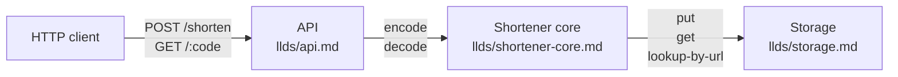

# High-Level Design: urlshort

A URL shortener, specified as LID intent. Deliberately stack-agnostic — implementation decisions are left to the generated code.

## Problem

Long URLs — especially those with tracking parameters or embedded state — are awkward to share in contexts where space matters (SMS, printed media, spoken aloud, QR codes). Users want a shorter equivalent that resolves to the same destination, without sacrificing the reliability or permanence of the original link.

Existing commercial shorteners exist but often bundle analytics, link expiration, or account requirements that aren't wanted in every context. This example is the minimum-viable shortener: take a long URL in, give a short URL back, redirect when visited.

## Approach

Assign each submitted URL a compact identifier (a "short code"), persist the mapping, and expose two operations: create-short-code and follow-short-code. The short code is stable over the lifetime of the mapping — users can share it without worrying about it changing.

Codes are generated from an ascending integer ID, encoded in base62 (alphanumeric characters). This is preferred over hashes because (a) codes are deterministically short (~6 characters covers ~56 billion URLs), (b) they don't require collision handling, (c) they're guessable in sequence but that's acceptable for this example — this is not a security tool.

The system is deliberately stateless at the API layer and stateful at the storage layer. The storage contract is minimal (three operations — see `storage.md`) so the implementation can be backed by SQLite, Postgres, Redis, DynamoDB, a flat file, or whatever the agent picks.

## Target Users

- **Casual sharers** — someone posting a link in a group chat, on a physical sign, or reading aloud.
- **Bookmarklets and automation scripts** — programmatic callers who submit a long URL and want a short one back.

Not intended for: analytics-driven marketing campaigns, link-rewriting proxies, branded domains, A/B-tested variants. Those are valuable products but not this one.

## Goals

1. **Round-trip fidelity.** A short URL always resolves to the exact long URL that was submitted. Byte-for-byte.
2. **Compact codes.** The short code is meaningfully shorter than the original URL for typical inputs. Target: ≤ 8 characters for the first few billion entries.
3. **Deterministic for existing URLs.** Submitting the same long URL twice yields the same short code. No duplicate mappings.
4. **Resolve fast.** Following a short URL is a single storage lookup plus an HTTP redirect. No computation on the hot path.
5. **Fail honestly.** Unknown short codes return a 404 with a readable message, not a 302 to a random page.

## Non-Goals

- **Analytics / click tracking.** No counting visits, no referrers, no dashboards. If you want that, fork and add it.
- **Link expiration.** Mappings are permanent. Deletion is a manual database operation, not a feature.
- **Authentication.** No user accounts. Anyone can create a short code; anyone can follow one. This is a library-style service, not a SaaS product.
- **Custom short codes.** Users don't pick their code. The system generates it.
- **URL validation beyond parsing.** The system verifies that the submitted string is a syntactically-valid URL. It does not check the destination is live, not malicious, or not in a safe-browsing blocklist.

## System Design

Three intent components:

- **API** (`llds/api.md`) — HTTP surface. Two endpoints. Translates between HTTP and shortener-core's internal shape.
- **Shortener core** (`llds/shortener-core.md`) — encode/decode logic, short-code format, duplicate detection. The one module that stays fixed regardless of storage or transport.
- **Storage** (`llds/storage.md`) — persistence contract. Three operations. Whatever backend satisfies the contract works.

The API component and core component together can live in one process. Storage may be in-process (SQLite, flat file) or remote (Postgres, Redis) — the API doesn't care. Implementation picks one.

## Key Design Decisions

| Decision | Chosen | Alternatives | Rationale |
|---|---|---|---|
| Short-code encoding | Base62 of ascending integer ID | Hash of URL; random alphanumeric; human-readable phrase | Base62 gives deterministic compact codes without collision handling. Hashes require collision checks; random codes require uniqueness checks; phrases are cute but 3× longer. |
| Short-code length | Variable, grows with ID | Fixed 6-8 chars | Fixed-length needs to be sized for maximum expected IDs; variable avoids wasting bytes early and grows gracefully. |
| Duplicate handling | Return existing code for same URL | Generate new code per submission | Goal 3 (deterministic for existing URLs) means storage must support `lookup-by-url`. Accepted overhead on the create path. |
| URL normalization before hashing | None | Lowercase scheme+host, sort query params, strip fragments | Normalization changes byte-for-byte fidelity (Goal 1). Two URLs differing only in trailing slash are treated as different. Users who want canonicalization normalize before submission. |
| Storage transactionality | Strong consistency within a single code | Eventual consistency | A short code either exists and resolves, or doesn't exist. No "newly-created code returns 404 for a few seconds." |
| Authentication | None | API key; OAuth | Non-goal. |
| Rate limiting | None in this spec | Per-IP, per-key | Left to deployment / reverse proxy. Not intent. |

## Success Metrics

How we'd know this is working:

- Round-trip: for 100 randomly-selected URLs ever submitted, GET /:code returns a 302 to the exact submitted URL. 100%.
- Code length: median short-code length under the first 10,000 entries is ≤ 6 characters.
- Idempotency: submitting the same URL N times returns the same code N times.
- Resolution latency: p95 of GET /:code is dominated by the single storage read (< 10ms when storage is in-process; < 50ms over a network).
- 404 honesty: an invalid short code returns a 404 with a non-misleading body.

## FAQ

**Q: What if two people submit the same URL at the exact same moment?**
A: The first `put` wins; the second submission reads back the winner's code via `lookup-by-url`. Both callers get the same short code. See USH-CORE-006.

**Q: Is the short code guessable?**
A: Yes. Codes are base62-encoded ascending IDs. If you see code `abc`, code `abd` likely exists. This is not a security tool — it's a shortener.

**Q: Can I delete a mapping?**
A: Not through the API. Operators can delete rows from storage directly; the system does not expose this.

**Q: What if the destination URL becomes unreachable?**
A: The shortener still redirects. It doesn't know or care whether the destination works.

## References

- `docs/llds/shortener-core.md`
- `docs/llds/api.md`
- `docs/llds/storage.md`
- `docs/specs/shortener-core-specs.md`
- `docs/specs/api-specs.md`
- `docs/specs/storage-specs.md`
